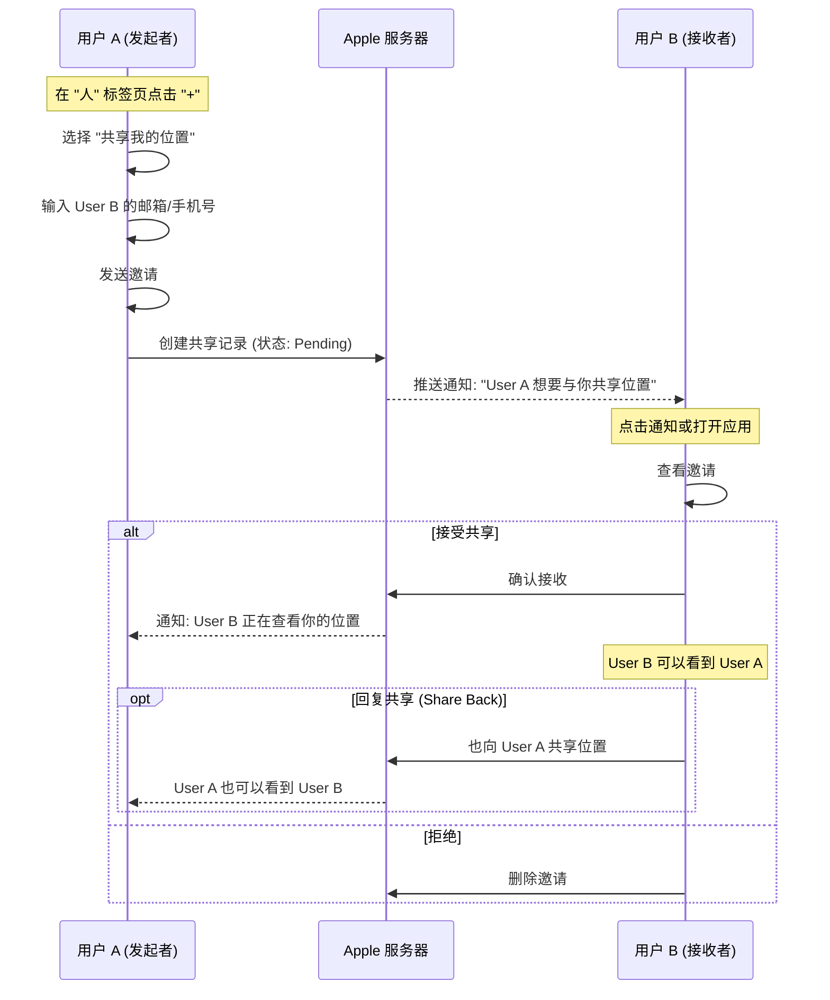

# iOS Find My 联系人添加 (共享位置) 逻辑分析与 Android 实现方案

本文档详细分析 iOS "查找" (Find My) 应用中"联系人/人" (People) 模块的交互逻辑，重点在于**位置共享**
的建立与管理，并结合 Firebase 提出 Android 端的实现方案。

## 1. iOS 联系人添加逻辑分析

iOS 的"联系人"功能核心在于**基于许可的双向或单向位置共享**。它不是简单的"添加好友"，而是"
我把我的位置共享给你"。

### 1.1 核心流程图 (iOS)



### 1.2 关键交互细节

1. **基于账号的查找**：通过 Apple ID (邮箱/手机号) 查找对方。
2. **时效性选择**：发起共享时，用户必须选择时长：
    * 分享一小时 (Share for One Hour)
    * 分享到当天结束 (Share Until End of Day)
    * 始终分享 (Share Indefinitely)
3. **单向优先**：A 分享给 B，B 可以看到 A，但 A 看不到 B，除非 B 主动"回享"。
4. **UI 展示**：在地图上，联系人的头像会显示在其当前位置；在列表中显示距离和地址。

---

## 2. Android 端实现方案

基于 Firebase Auth 和 Firestore，我们需要构建一套**用户系统**和**权限控制系统**。

### 2.1 数据模型设计

为了实现位置共享，我们需要扩展现有的 Firestore 结构。

#### A. 用户索引 (User Index)

为了能通过邮箱搜索到用户，需要一个可查询的用户集合。

* **Collection**: `users`
* **Document ID**: `uid` (Auth UID)
* **Fields**:
    * `email`: String (用于搜索)
    * `displayName`: String
    * `photoUrl`: String

#### B. 共享关系 (Location Shares)

记录谁把位置分享给了谁。

* **Collection**: `location_shares`
* **Document ID**: `auto-generated`
* **Fields**:
    * `fromUid`: String (分享者)
    * `toEmail`: String (接收者邮箱，用于处理未注册用户邀请)
    * `toUid`: String? (接收者 UID，接受后填充)
    * `status`: "PENDING" | "ACCEPTED"
    * `expireTime`: Timestamp? (过期时间，null 代表永久)
    * `createdAt`: Timestamp

### 2.2 业务流程设计

#### 流程 1: 发起共享 (Start Sharing)

1. **输入**: 用户输入对方邮箱。
2. **查询**: (可选) 检查该邮箱是否注册了 App。
3. **写入**: 在 `location_shares` 创建一条记录：
   ```json
   {
     "fromUid": "current_user_uid",
     "toEmail": "friend@example.com",
     "status": "PENDING",
     "expireTime": null // 或具体时间
   }
   ```

#### 流程 2: 接收/查看列表 (View People)

对于当前用户 (User B)，需要查询两类数据：

1. **我分享给谁的**: 查询 `location_shares` where `fromUid == myUid`。
2. **谁分享给我的**: 查询 `location_shares` where `toUid == myUid` OR `toEmail == myEmail`。

#### 流程 3: 获取位置 (Get Locations)

这是最关键的一步。User B 如何看到 User A 的设备位置？

**方案：基于 `sharedWith` 字段的设备查询**

修改 `devices` 集合的数据结构，添加 `sharedWith` 数组。

* 当 User A 分享给 User B (Accepted) 时，云函数 (Cloud Function) 或客户端逻辑将 User B 的 UID 添加到
  User A 的**主设备** (如手机) 的 `sharedWith` 字段中。
* **Device Document**:
  ```json
  {
    "ownerId": "userA_uid",
    "location": GeoPoint(...),
    "sharedWith": ["userB_uid", "userC_uid"] 
  }
  ```

**查询逻辑**:
User B 的地图不仅监听 `ownerId == myUid` 的设备，还要监听 `sharedWith array-contains myUid` 的设备。

### 2.3 Firestore 安全规则 (Security Rules)

```javascript
match /devices/{deviceId} {
  allow read: if request.auth != null && (
    resource.data.ownerId == request.auth.uid || 
    resource.data.sharedWith.hasAny([request.auth.uid])
  );
}
```

*注：`hasAny` 是示意，具体语法参考 Firestore 文档 `resource.data.sharedWith` 包含判断。*

### 2.4 Android UI 交互设计

#### A. 入口

* 在底部 BottomSheet 增加 "联系人" (People) 标签页，与 "设备" (Devices) 并列。
* 列表顶部显示 "共享我的位置" 按钮。

#### B. 添加联系人面板 (Modal)

1. **搜索栏**: 输入邮箱。
2. **结果列表**: 如果匹配到用户显示头像，否则显示"发送邀请给 [邮箱]"。
3. **时长选择**: 简单的单选组 (1小时 / 永久)。
4. **发送按钮**: 点击写入 Firestore。

#### C. 联系人列表项

* **头像**: 圆形头像。
* **状态**:
    * "正在等待接受..." (Pending)
    * "北京, 朝阳区 (10分钟前)" (Accepted & Active)
* **操作**: 点击进入详情，可"停止共享"或"请求关注"。

---

## 3. 开发步骤建议

1. **Auth 扩展**: 确保用户登录后，将用户信息写入 `users` 集合（`UserSyncWorker`）。
2. **Repository 层**:
    * `ContactRepository`: 处理 `location_shares` 的增删改查。
    * 修改 `DeviceRepository`: `observeDevices` 需要支持查询别人分享给我的设备。
3. **UI 实现**:
    * 实现 `PeopleListScreen`。
    * 实现 `ShareLocationDialog`。
4. **逻辑联调**:
    * 模拟两个用户 A 和 B。
    * A 分享给 B。
    * 验证 B 能否在地图上看到 A。

---
**文档位置**: `@docs\ADD_CONTACT_LOGIC.md`
