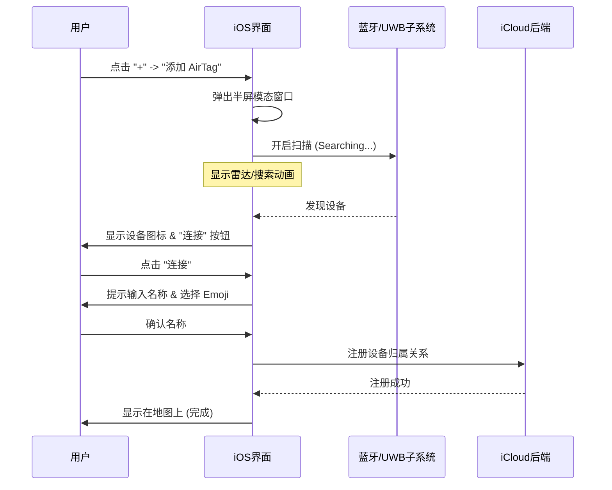
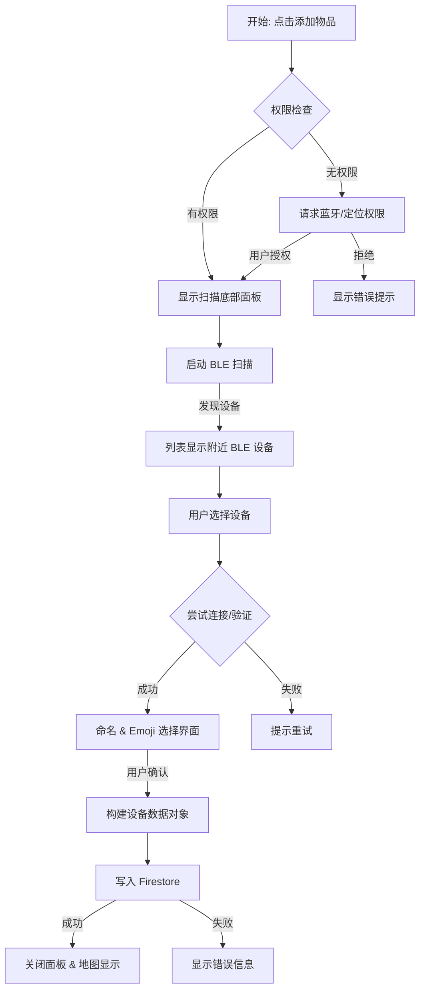

# iOS Find My 物品添加逻辑分析与 Android 实现方案

本文档详细分析 iOS "查找" (Find My) 应用中添加物品（如 AirTag 或第三方配件）的交互逻辑，并结合 Android 平台特性（Android 15/API 36）提出相应的实现方案。

## 1. iOS 物品添加逻辑分析

iOS 的添加流程以"模态窗口"（Modal）和"分步引导"（Step-by-Step Wizard）为核心，强调无缝连接和可视化反馈。

### 1.1 核心流程图 (iOS)



### 1.2 关键交互细节
1.  **入口**：底部导航栏 "物品" -> "+" 按钮。
2.  **搜索态**：半屏面板，显示动态搜索动画（寻找信号的效果），给予用户正在工作的心理暗示。
3.  **发现态**：当设备靠近时，动画改变，显示具体产品图。
4.  **命名与个性化**：
    *   提供预设名称（钥匙、钱包、背包）。
    *   强制要求选择一个 Emoji，该 Emoji 会直接作为地图上的大头针图标（这一点是 Find My 的标志性设计）。
5.  **绑定**：将 BLE MAC 地址或公钥与 Apple ID 绑定。

---

## 2. Android 端实现方案

基于 Google Maps SDK 和 Firebase，我们在 Android 上复刻这一体验。

### 2.1 业务流程设计

在 Android 端，我们使用 `ModalBottomSheet` (Compose) 来承载添加流程，利用 `BluetoothLeScanner` 进行设备发现。

**注意**：由于 AirTag 协议私有，我们假设添加的是"兼容 BLE 的追踪器"或"模拟设备"。如果是添加其他 Android 手机，则通常通过在该手机上登录账号自动添加，而非此扫描流程。本流程专用于添加**蓝牙配件/物品**。

### 2.2 Android 流程图 (Mermaid)



### 2.3 关键功能模块设计

#### A. 入口 (Entry Point)
在 `MainScreen` 的地图层或设备列表层添加悬浮按钮 (FAB) 或顶部栏菜单项。

*   **位置**：设备列表面板 (BottomSheet) 的标题栏右侧，放置一个圆形的 "+" 号。
*   **点击动作**：打开一个新的 `ModalBottomSheet`，状态由 `AddDeviceViewModel` 控制。

#### B. 扫描界面 (Scanning UI)
*   **UI 组件**：使用 Jetpack Compose 的 `ModalBottomSheet`。
*   **视觉效果**：使用 Canvas 绘制类似雷达扩散的圆圈动画，暗示正在搜索。
*   **技术实现**：
    *   使用 `Context.getSystemService(BluetoothManager::class.java)`。
    *   调用 `bluetoothAdapter.bluetoothLeScanner.startScan()`。
    *   **过滤**：为了避免扫描到无数杂乱的蓝牙设备，建议根据 `Service UUID` 或设备名称前缀进行过滤（例如只显示名称包含 "FindMy" 或特定厂商 ID 的设备）。

#### C. 命名与 Emoji (Naming & Emoji)
*   **命名输入**：标准的 `OutlinedTextField`。
*   **Emoji 选择器**：
    *   由于 Android 没有系统级 Emoji Picker View，可以实现一个简单的 Grid 列表，预设常用 Emoji (🔑, 🎒, 👛, 🚲, 📷)。
    *   或者调用系统键盘输入 Emoji。
*   **数据关联**：选中的 Emoji 将作为 `Device` 数据模型中的一个字段（如 `icon` 或 `emoji`），用于地图 Marker 渲染。

#### D. 数据存储 (Data Persistence)
当用户完成添加后，在 Firestore `devices` 集合创建一个新文档。

**数据结构示例 (Device.kt 扩展)**：
```kotlin
data class Device(
    val id: String = UUID.randomUUID().toString(),
    val name: String,        // 用户输入的名称
    val icon: String,        // Emoji 字符，例如 "🔑"
    val type: DeviceType = DeviceType.TAG, // 物品类型
    val ownerId: String,     // 当前登录用户 UID
    val macAddress: String?, // 蓝牙 MAC 地址（用于后续重连）
    val location: GeoPoint,  // 初始位置（使用手机当前位置）
    // ... 其他字段
)
```

**逻辑说明**：
因为蓝牙 Tag 本身没有 GPS，**添加时的初始位置应设为手机当前的 GPS 位置**。后续位置更新依赖于手机扫描到该 Tag 时上报手机的位置（众包网络原理）。

### 2.4 权限需求 (AndroidManifest.xml)

Android 12+ (API 31+) 需要精确的蓝牙权限：

```xml
<!-- 发现附近设备 -->
<uses-permission android:name="android.permission.BLUETOOTH_SCAN"
        android:usesPermissionFlags="neverForLocation" />
<!-- 连接设备 -->
<uses-permission android:name="android.permission.BLUETOOTH_CONNECT" />
<!-- 传统定位权限 (Android 11及以下需要，或用于通过蓝牙推断位置) -->
<uses-permission android:name="android.permission.ACCESS_FINE_LOCATION" />
```

## 3. 开发步骤建议

1.  **Model 更新**：更新 `Device` 数据类，增加 `icon` (Emoji) 和 `macAddress` 字段。
2.  **UI 实现**：
    *   创建 `AddDeviceScreen.kt` (扫描页、命名页)。
    *   实现雷达扫描动画。
3.  **ViewModel**：创建 `AddDeviceViewModel` 处理蓝牙扫描回调和状态流 (StateFlow)。
4.  **权限处理**：使用 Accompanist Permissions 或 AndroidX Activity Result API 处理运行时权限请求。
5.  **联调**：使用两台 Android 设备，一台作为广播端（模拟 Tag），一台作为扫描端进行测试。

---
**文档位置**: `@docs\ADD_DEVICE_LOGIC.md`
