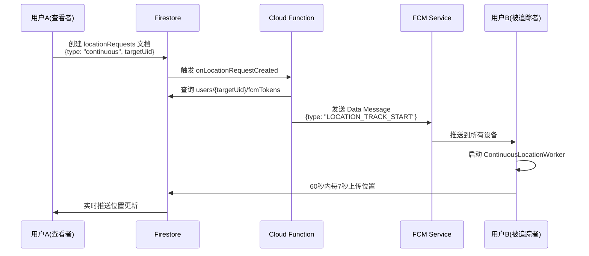

# Cloud Function - 短时实时追踪实现指南

本文档说明如何实现 Cloud Function 来处理短时实时追踪（60秒高频位置更新）的 FCM 消息发送。

## 概述

当用户 A 开始追踪用户 B 时，系统需要：
1. 监听 Firestore `locationRequests` 集合的新文档
2. 识别追踪类型（`type: continuous` 或 `type: stop_continuous`）
3. 向目标用户的所有设备发送相应的 FCM Data Message

## 数据流程



## Firestore 数据结构

### locationRequests 集合

```javascript
// locationRequests/{requestId}
{
  requesterUid: string,      // 请求者 UID
  targetUid: string,          // 目标用户 UID
  type: string,               // "single" | "continuous" | "stop_continuous"
  timestamp: number,          // 请求时间戳
  status: string,             // "pending" | "sent" | "failed"
  successCount: number?,      // 成功发送的设备数
  failureCount: number?       // 发送失败的设备数
}
```

### users 集合（FCM Tokens）

```javascript
// users/{uid}
{
  uid: string,
  email: string,
  fcmTokens: string[]        // 该用户的所有设备 FCM Token
}
```

## Cloud Function 实现

### 1. 依赖安装

在 `functions` 目录下运行：

```bash
npm install firebase-functions firebase-admin
```

### 2. 初始化 Admin SDK

```javascript
// functions/src/index.ts
import * as functions from 'firebase-functions';
import * as admin from 'firebase-admin';

admin.initializeApp();
const db = admin.firestore();
const messaging = admin.messaging();
```

### 3. 核心处理函数

```typescript
/**
 * 监听 locationRequests 集合，发送 FCM 消息
 * 触发条件：每次在 locationRequests 集合创建新文档时
 */
export const onLocationRequestCreated = functions.firestore
  .document('locationRequests/{requestId}')
  .onCreate(async (snapshot, context) => {
    const requestId = context.params.requestId;
    const data = snapshot.data();

    const { requesterUid, targetUid, type, timestamp } = data;

    // 验证必需字段
    if (!requesterUid || !targetUid || !type) {
      console.error(`❌ 无效的请求数据: ${requestId}`, data);
      await snapshot.ref.update({ status: 'failed', error: 'Missing required fields' });
      return;
    }

    console.log(`📬 收到位置请求: ${requestId}`, {
      type,
      requesterUid,
      targetUid,
      timestamp: new Date(timestamp).toISOString()
    });

    try {
      // 1. 查询目标用户的 FCM Tokens
      const userDoc = await db.collection('users').doc(targetUid).get();
      if (!userDoc.exists) {
        throw new Error(`目标用户不存在: ${targetUid}`);
      }

      const fcmTokens = userDoc.data()?.fcmTokens || [];
      if (fcmTokens.length === 0) {
        throw new Error(`目标用户没有注册的设备: ${targetUid}`);
      }

      console.log(`🎯 找到 ${fcmTokens.length} 个设备，准备发送 FCM 消息`);

      // 2. 根据请求类型构建 FCM 消息
      const message = buildFCMMessage(type, requesterUid, targetUid);

      // 3. 发送 FCM 消息到所有设备
      const response = await messaging.sendEachForMulticast({
        tokens: fcmTokens,
        data: message
      });

      // 4. 处理发送结果
      console.log(`✅ FCM 发送完成: 成功 ${response.successCount}, 失败 ${response.failureCount}`);

      // 5. 更新请求状态
      await snapshot.ref.update({
        status: 'sent',
        successCount: response.successCount,
        failureCount: response.failureCount,
        sentAt: admin.firestore.FieldValue.serverTimestamp()
      });

      // 6. 清理无效的 FCM Token
      if (response.failureCount > 0) {
        await cleanupInvalidTokens(targetUid, fcmTokens, response.responses);
      }

    } catch (error) {
      console.error(`❌ 处理位置请求失败: ${requestId}`, error);
      await snapshot.ref.update({
        status: 'failed',
        error: String(error)
      });
    }
  });

/**
 * 根据请求类型构建 FCM Data Message
 */
function buildFCMMessage(type: string, requesterUid: string, targetUid: string): Record<string, string> {
  switch (type) {
    case 'single':
      // 单次位置请求
      return {
        type: 'LOCATION_REQUEST',
        requesterUid: requesterUid,
        targetUid: targetUid
      };

    case 'continuous':
      // 开始短时实时追踪（60秒）
      return {
        type: 'LOCATION_TRACK_START',
        requesterUid: requesterUid,
        targetUid: targetUid,
        duration: '60' // 60秒
      };

    case 'stop_continuous':
      // 停止实时追踪
      return {
        type: 'LOCATION_TRACK_STOP',
        requesterUid: requesterUid,
        targetUid: targetUid
      };

    default:
      throw new Error(`不支持的请求类型: ${type}`);
  }
}

/**
 * 清理无效的 FCM Token
 * 当设备卸载应用或Token失效时，从数据库中移除
 */
async function cleanupInvalidTokens(
  userId: string,
  tokens: string[],
  responses: admin.messaging.SendResponse[]
) {
  const tokensToRemove: string[] = [];

  responses.forEach((response, index) => {
    if (!response.success) {
      const error = response.error;
      // 检查是否是永久性错误（Token失效）
      if (
        error?.code === 'messaging/invalid-registration-token' ||
        error?.code === 'messaging/registration-token-not-registered'
      ) {
        tokensToRemove.push(tokens[index]);
      }
    }
  });

  if (tokensToRemove.length > 0) {
    console.log(`🗑️ 清理 ${tokensToRemove.length} 个无效 Token`);
    await db.collection('users').doc(userId).update({
      fcmTokens: admin.firestore.FieldValue.arrayRemove(...tokensToRemove)
    });
  }
}
```

### 4. 自动清理过期请求（可选）

为了防止 `locationRequests` 集合无限增长，可以添加定时清理：

```typescript
/**
 * 每小时清理一次超过 24 小时的旧请求记录
 */
export const cleanupOldLocationRequests = functions.pubsub
  .schedule('every 1 hours')
  .onRun(async (context) => {
    const now = Date.now();
    const oneDayAgo = now - 24 * 60 * 60 * 1000;

    const snapshot = await db.collection('locationRequests')
      .where('timestamp', '<', oneDayAgo)
      .limit(500) // 每次最多删除 500 条
      .get();

    if (snapshot.empty) {
      console.log('✅ 没有需要清理的旧请求记录');
      return;
    }

    const batch = db.batch();
    snapshot.docs.forEach(doc => {
      batch.delete(doc.ref);
    });

    await batch.commit();
    console.log(`🗑️ 已清理 ${snapshot.size} 条旧请求记录`);
  });
```

## 部署步骤

### 1. 初始化 Firebase Functions（如果尚未初始化）

```bash
# 在项目根目录
firebase init functions

# 选择：
# - TypeScript
# - ESLint
# - 安装依赖
```

### 2. 编译并部署

```bash
cd functions
npm run build
firebase deploy --only functions
```

### 3. 验证部署

部署成功后，Firebase Console 会显示：
- `onLocationRequestCreated` - Firestore 触发器
- `cleanupOldLocationRequests` - 定时任务（可选）

## 测试方法

### 1. 手动创建测试请求

在 Firestore Console 中手动创建文档：

```javascript
// 集合: locationRequests
// 文档 ID: 自动生成
{
  requesterUid: "用户A的UID",
  targetUid: "用户B的UID",
  type: "continuous",
  timestamp: Date.now(),
  status: "pending"
}
```

### 2. 检查日志

```bash
firebase functions:log --only onLocationRequestCreated
```

预期输出：
```
📬 收到位置请求: abc123...
🎯 找到 2 个设备，准备发送 FCM 消息
✅ FCM 发送完成: 成功 2, 失败 0
```

### 3. Android 端验证

- 检查 `MyFirebaseMessagingService.kt` 的调试通知
- 查看 Logcat: `adb logcat -s MyFirebaseMsgService ContinuousLocationWorker`

## 错误处理

### 常见错误及解决方案

| 错误代码 | 含义 | 解决方案 |
|---------|-----|---------|
| `messaging/invalid-registration-token` | FCM Token 无效 | 自动清理（已实现） |
| `messaging/registration-token-not-registered` | Token 未注册 | 自动清理（已实现） |
| `messaging/invalid-argument` | 消息格式错误 | 检查 Data Message 字段 |
| `messaging/quota-exceeded` | 发送频率超限 | 实现客户端防抖（已实现） |

### 调试技巧

1. **启用详细日志**
   ```typescript
   functions.logger.debug('详细调试信息', { data });
   ```

2. **本地模拟器测试**
   ```bash
   firebase emulators:start --only functions,firestore
   ```

3. **监控 FCM 发送状态**
   ```typescript
   console.log('FCM Response:', JSON.stringify(response, null, 2));
   ```

## 性能优化

### 1. 批量处理

当多个请求同时到达时，使用批处理：

```typescript
export const processBatchRequests = functions.pubsub
  .schedule('every 5 minutes')
  .onRun(async (context) => {
    const pendingRequests = await db.collection('locationRequests')
      .where('status', '==', 'pending')
      .where('timestamp', '>', Date.now() - 5 * 60 * 1000)
      .get();

    // 批量处理...
  });
```

### 2. 缓存 FCM Tokens

使用 Firebase Functions 的内存缓存：

```typescript
const tokenCache = new Map<string, { tokens: string[], timestamp: number }>();
const CACHE_TTL = 5 * 60 * 1000; // 5分钟

async function getCachedTokens(userId: string): Promise<string[]> {
  const cached = tokenCache.get(userId);
  if (cached && Date.now() - cached.timestamp < CACHE_TTL) {
    return cached.tokens;
  }

  const userDoc = await db.collection('users').doc(userId).get();
  const tokens = userDoc.data()?.fcmTokens || [];
  tokenCache.set(userId, { tokens, timestamp: Date.now() });
  return tokens;
}
```

## 安全规则

确保 Firestore 安全规则允许客户端创建请求：

```javascript
// firestore.rules
rules_version = '2';
service cloud.firestore {
  match /databases/{database}/documents {
    // 位置请求规则
    match /locationRequests/{requestId} {
      // 仅允许认证用户创建自己发起的请求
      allow create: if request.auth != null
                    && request.resource.data.requesterUid == request.auth.uid;

      // 禁止客户端读取或修改
      allow read, update, delete: if false;
    }
  }
}
```

## 成本估算

### FCM 免费额度
- 无限制免费发送（Google提供）

### Cloud Functions 费用（按调用次数）
- 前 2,000,000 次调用/月：免费
- 后续：$0.40 / 百万次调用

### 示例：
- 100 名用户
- 每人每天发起 10 次追踪
- 每月调用次数：100 × 10 × 30 = 30,000 次
- **费用：免费**

## 下一步

- [x] Android 客户端实现
- [x] Cloud Function 实现指南
- [ ] 实际部署到 Firebase
- [ ] 监控和优化性能
- [ ] 添加用户反馈收集

## 参考文档

- [Firebase Cloud Functions 文档](https://firebase.google.com/docs/functions)
- [FCM Admin SDK](https://firebase.google.com/docs/cloud-messaging/admin)
- [Firestore 触发器](https://firebase.google.com/docs/functions/firestore-events)
