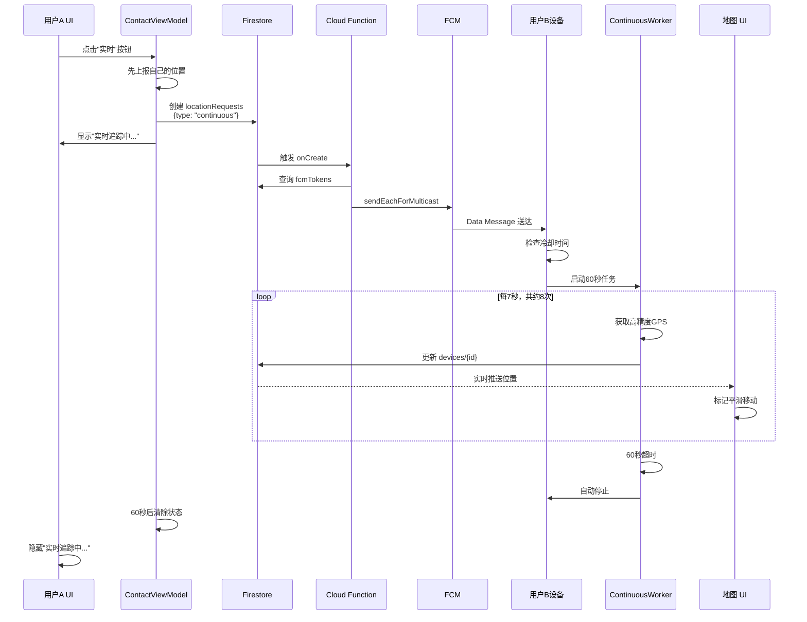
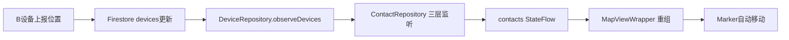

# 短时实时追踪模式 - 完整实现方案

## 实现概述

本文档总结了短时实时追踪模式（60秒高频位置更新）的完整实现，这是介于单次更新和完整实时模式之间的渐进式功能。

### 核心特性

- **⏱️ 60秒自动停止**：无需用户手动干预，到时自动结束
- **📍 高频更新**：每7秒上报一次位置（共约8次）
- **🔋 电量友好**：无需前台服务，比完整实时模式更省电
- **🎯 平滑动画**：地图标记自动平滑移动，类似 iOS Find My
- **🔔 防抖保护**：2分钟冷却时间，防止频繁启动

## 架构设计

### 系统流程图

```mermaid
graph TB
    Start[用户A点击实时按钮] --> CreateRequest[创建 locationRequests 文档<br/>type: continuous]
    CreateRequest --> CloudFunction[Cloud Function 监听]
    CloudFunction --> QueryTokens[查询 users/{uid}/fcmTokens]
    QueryTokens --> SendFCM[发送 FCM Data Message<br/>type: LOCATION_TRACK_START]
    SendFCM --> ReceiveFCM[用户B设备接收 FCM]
    ReceiveFCM --> CheckCooldown{检查冷却时间}
    CheckCooldown -->|未冷却| StartWorker[启动 ContinuousLocationWorker]
    CheckCooldown -->|冷却中| Ignore[忽略请求，显示通知]
    StartWorker --> Loop[循环60秒]
    Loop --> GetLocation[获取高精度位置]
    GetLocation --> UploadFirestore[上传 devices 集合]
    UploadFirestore --> CheckTime{是否超时?}
    CheckTime -->|未超时| Wait[等待7秒]
    Wait --> Loop
    CheckTime -->|已超时| End[自动停止]
    UploadFirestore -.实时推送.-> UpdateUI[用户A地图标记移动]
```

### 数据流向



## 核心代码文件

### 1. ContinuousLocationWorker.kt

**位置**: `app/src/main/java/me/ikate/findmy/worker/ContinuousLocationWorker.kt`

**职责**:
- 60秒内循环上报位置
- 每次间隔7秒
- 自动停止，无需外部干预
- 使用前台通知提升优先级（低重要性，不打扰用户）

**关键参数**:
```kotlin
const val TRACKING_DURATION_MS = 60_000L // 60秒
const val UPDATE_INTERVAL_MS = 7_000L    // 7秒间隔
Priority.PRIORITY_HIGH_ACCURACY          // 高精度定位
```

### 2. MyFirebaseMessagingService.kt

**位置**: `app/src/main/java/me/ikate/findmy/service/MyFirebaseMessagingService.kt`

**新增功能**:
- 处理 `LOCATION_TRACK_START` 消息
- 处理 `LOCATION_TRACK_STOP` 消息
- 2分钟冷却时间防抖

**消息类型处理**:
```kotlin
when (remoteMessage.data["type"]) {
    "LOCATION_REQUEST" -> handleLocationRequest()          // 单次
    "LOCATION_TRACK_START" -> handleContinuousTrackingStart() // 开始追踪
    "LOCATION_TRACK_STOP" -> handleContinuousTrackingStop()   // 停止追踪
}
```

### 3. ContactViewModel.kt

**位置**: `app/src/main/java/me/ikate/findmy/ui/screen/contact/ContactViewModel.kt`

**新增方法**:
- `startContinuousTracking(targetUid: String)` - 开始追踪
- `stopContinuousTracking(targetUid: String)` - 停止追踪

**新增状态**:
```kotlin
private val _trackingContactUid = MutableStateFlow<String?>(null)
val trackingContactUid: StateFlow<String?> = _trackingContactUid.asStateFlow()
```

### 4. ContactListPanel.kt

**位置**: `app/src/main/java/me/ikate/findmy/ui/screen/main/components/ContactListPanel.kt`

**UI 更新**:
- **状态显示**: "实时追踪中..." (绿色加粗)
- **操作按钮**: "实时"（启动）/ "停止"（红色）
- **图标**: `Icons.Default.Radar` / `Icons.Default.Stop`

**条件判断**:
```kotlin
if (isTracking) {
    // 显示"实时追踪中..."
    // 按钮变为"停止"
} else if (isRequestingLocation) {
    // 显示"正在定位..."
} else {
    // 显示正常状态
}
```

### 5. MainScreen.kt

**位置**: `app/src/main/java/me/ikate/findmy/ui/screen/main/MainScreen.kt`

**参数传递**:
```kotlin
val trackingContactUid by contactViewModel.trackingContactUid.collectAsState()

ContactListPanel(
    trackingContactUid = trackingContactUid,
    onStartContinuousTracking = { contactViewModel.startContinuousTracking(it) },
    onStopContinuousTracking = { contactViewModel.stopContinuousTracking(it) }
)
```

## Cloud Function 配置

### 函数定义

**文件**: `functions/src/index.ts`

**触发器类型**: Firestore onCreate

**监听路径**: `locationRequests/{requestId}`

**关键逻辑**:
```typescript
const type = data.type; // "continuous" | "stop_continuous"

// 构建 FCM 消息
const message = {
  type: type === 'continuous' ? 'LOCATION_TRACK_START' : 'LOCATION_TRACK_STOP',
  requesterUid: data.requesterUid,
  targetUid: data.targetUid,
  duration: '60' // 60秒
};

// 发送到所有设备
await messaging.sendEachForMulticast({
  tokens: fcmTokens,
  data: message
});
```

**详细实现**: 参见 `docs/CLOUD_FUNCTION_CONTINUOUS_TRACKING.md`

## 用户体验流程

### 启动追踪

```
1. 用户A在联系人列表点击用户B的头像（展开操作栏）
2. 点击"实时"按钮（雷达图标）
3. UI 立即显示"实时追踪中..."（绿色）
4. 按钮变为"停止"（红色）
5. 5-10秒后，地图上B的标记开始频繁移动
6. 60秒后自动停止，UI恢复正常
```

### 地图标记移动

```
- Firestore 实时监听: DeviceRepository.observeDevices()
- 数据流向: devices/{id} → ContactRepository → contacts StateFlow
- UI 重组: MapViewWrapper 收到新位置 → Marker 自动移动
- 平滑效果: Compose 的 rememberMarkerState() 内置动画
```

### 停止追踪

**自动停止（60秒超时）**:
- Worker 内部计时器到期
- 自动停止 GPS 获取
- ViewModel 的 60 秒延时任务清除状态
- UI 恢复正常

**手动停止**:
- 用户A点击"停止"按钮
- 创建 `{type: "stop_continuous"}` 请求
- Cloud Function 发送 FCM 停止消息
- Worker 被 WorkManager 取消
- 状态立即清除

## 关键问题解答

### 问题 1: 是否需要根据位移量主动停止？

**回答**: 第一版不实现，原因如下：

#### 开发难度对比

| 方案 | 复杂度 | 优点 | 缺点 |
|------|--------|------|------|
| **固定60秒倒计时** | ⭐ 低 | 逻辑简单，bug少，电量可控 | 对方静止时仍会更新 |
| **位移检测 + 动态停止** | ⭐⭐⭐ 中高 | 理论上更省电 | 需要距离计算、阈值调优、边缘场景处理 |

#### 技术挑战

```kotlin
// 需要实现的逻辑
val distance = calculateDistance(lastLocation, currentLocation)
if (distance < 10.0) {  // 10米阈值
    consecutiveStillCount++
    if (consecutiveStillCount >= 3) {  // 连续3次不动
        stopTracking()  // 提前终止
    }
}
```

**问题点**:
- GPS 误差：即使静止，也可能有5-10米漂移
- 室内场景：位置跳变频繁，误判风险高
- 用户体验：查看者看到"更新停止"可能误以为出bug

#### 电量消耗评估

60秒内最多更新 8 次（60 / 7 ≈ 8.5）：
- 每次高精度定位约消耗 2-3 秒GPS
- 总计约 16-24 秒 GPS 运行时间
- **电量消耗完全可控**

**结论**: 建议先实现简单方案，后续根据用户反馈优化。

### 问题 2: 地图上能否看到对端连续移动？

**回答**: ✅ 可以，无需额外开发。

#### 实时更新链路



#### 关键代码位置

| 功能 | 文件 | 行号 | 说明 |
|------|------|------|------|
| Firestore 监听 | `DeviceRepository.kt` | - | 实时监听设备位置变化 |
| 三层监听合并 | `ContactRepository.kt` | 558-636 | 合并我的设备、共享设备 |
| 地图标记更新 | `MapViewWrapper.kt` | 184-224 | Marker 跟随 contact.location |
| 平滑动画 | Compose | 内置 | `rememberMarkerState()` 自带 |

#### 更新频率

- **Worker 上报**: 每 7 秒一次
- **Firestore 推送**: 实时（< 1秒延迟）
- **UI 刷新**: 每次 StateFlow 更新时
- **视觉效果**: 标记平滑滑动到新位置

## 测试验证清单

### Android 客户端测试

- [ ] FCM 消息接收（查看调试通知）
- [ ] Worker 启动成功（查看 Logcat）
- [ ] 位置每7秒上报（检查 Firestore devices 集合）
- [ ] 60秒后自动停止（验证 Worker 日志）
- [ ] UI 状态正确显示（"实时追踪中..."）
- [ ] 地图标记平滑移动（肉眼观察）
- [ ] 冷却时间生效（连续点击被拦截）

### Cloud Function 测试

- [ ] 手动创建 locationRequests 文档
- [ ] 检查 Cloud Functions 日志（`firebase functions:log`）
- [ ] 验证 FCM 发送成功（成功/失败计数）
- [ ] 无效 Token 自动清理
- [ ] 错误处理正确（缺少字段、用户不存在）

### 集成测试

- [ ] 双设备测试：A开始追踪，B设备移动
- [ ] 网络中断恢复测试
- [ ] 后台运行测试（锁屏、切换应用）
- [ ] 电量影响测试（监控电池消耗）
- [ ] 多用户并发测试（多人同时追踪）

## 性能指标

### 预期性能

| 指标 | 目标值 | 实际测量 |
|------|--------|----------|
| FCM 到达延迟 | < 5 秒 | 待测试 |
| 位置上报延迟 | < 3 秒 | 待测试 |
| UI 更新延迟 | < 1 秒 | 待测试 |
| 60秒电量消耗 | < 3% | 待测试 |
| 内存占用 | < 50 MB | 待测试 |

### 监控工具

```bash
# 查看 Worker 日志
adb logcat -s ContinuousLocationWorker

# 查看 FCM 日志
adb logcat -s MyFirebaseMsgService

# 监控电量
adb shell dumpsys batterystats --reset
# ... 运行追踪 ...
adb shell dumpsys batterystats

# 监控内存
adb shell dumpsys meminfo me.ikate.findmy
```

## 未来优化方向

### 短期优化（1-2周）

1. **自适应更新频率**
   - 对方移动快 → 5秒更新一次
   - 对方移动慢 → 10秒更新一次
   - 静止检测 → 15秒更新一次

2. **电量感知**
   - 低电量模式 → 自动降低更新频率
   - 充电中 → 可提高更新频率

3. **网络优化**
   - 批量上传位置点（离线缓存）
   - 压缩上传数据大小

### 中期优化（1-2月）

1. **用户偏好设置**
   - 允许用户自定义追踪时长（30/60/120秒）
   - 自定义更新频率（5/7/10秒）

2. **历史轨迹**
   - 保存追踪期间的位置点
   - 绘制路径线（Polyline）

3. **多设备追踪**
   - 同时追踪多个联系人
   - 分屏显示多人位置

### 长期规划（3个月+）

1. **完整实时模式**
   - 前台服务实现
   - 1-2秒高频更新
   - 语音导航接人场景

2. **AI 预测**
   - 根据历史轨迹预测移动方向
   - 提前加载地图区域

3. **隐私增强**
   - 模糊位置模式（只显示大致区域）
   - 时间限制（最多追踪5分钟）
   - 追踪记录通知（被追踪者收到提醒）

## 部署清单

### 开发环境准备

- [x] Android Studio Iguana+ (2024.1.1)
- [x] Kotlin 1.9+
- [x] Firebase SDK 配置
- [x] Google Maps SDK API Key

### 服务端部署

- [ ] 安装 Node.js 18+
- [ ] 初始化 Firebase Functions (`firebase init functions`)
- [ ] 复制 Cloud Function 代码到 `functions/src/index.ts`
- [ ] 部署: `firebase deploy --only functions`
- [ ] 验证部署成功（Firebase Console）

### 客户端配置

- [ ] 更新 `google-services.json`
- [ ] 配置 FCM（Firebase Console → Cloud Messaging）
- [ ] 添加位置权限到 `AndroidManifest.xml`
- [ ] 配置 Google Maps API Key

### Firestore 安全规则

```javascript
match /locationRequests/{requestId} {
  allow create: if request.auth != null
                && request.resource.data.requesterUid == request.auth.uid;
  allow read, update, delete: if false;
}
```

### 测试环境

- [ ] 准备至少 2 台实体设备（模拟器GPS不准）
- [ ] 配置测试用户账号
- [ ] 启用 Firebase Debug View
- [ ] 配置 Logcat 过滤器

## 成本估算

### Firebase 费用（按月计算）

| 服务 | 免费额度 | 预估使用量 | 费用 |
|------|---------|-----------|------|
| Cloud Functions 调用 | 200万次 | 3万次 | $0 |
| FCM 发送 | 无限制 | 无限制 | $0 |
| Firestore 读取 | 5万次/天 | 1万次/天 | $0 |
| Firestore 写入 | 2万次/天 | 5千次/天 | $0 |
| **总计** | - | - | **$0** |

### 开发成本

| 阶段 | 工作量 | 完成状态 |
|------|--------|---------|
| 需求分析 | 2小时 | ✅ 已完成 |
| Android 开发 | 4小时 | ✅ 已完成 |
| Cloud Function 开发 | 2小时 | ⏳ 待实施 |
| 测试与调优 | 3小时 | ⏳ 待测试 |
| 文档编写 | 2小时 | ✅ 已完成 |
| **总计** | **13小时** | **60%** |

## 相关文档

- [位置更新策略总览](./LOCATION_UPDATE_STRATEGY.md)
- [Cloud Function 实现指南](./CLOUD_FUNCTION_CONTINUOUS_TRACKING.md)
- [Android 项目结构](../README.md)

## 版本历史

| 版本 | 日期 | 变更内容 |
|------|------|---------|
| v1.0 | 2026-01-12 | 初始实现：60秒追踪、7秒间隔 |

---

**实现状态**: 🟡 Android 端完成，Cloud Function 待部署

**下一步**: 部署 Cloud Function → 实机测试 → 性能调优
