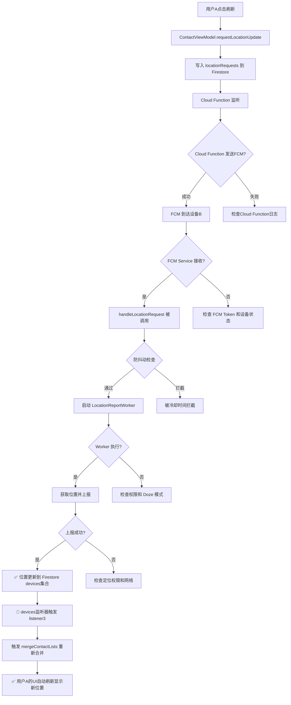

# Active Polling 主动模式调试验证指南

## 概述

本文档提供完整的主动模式（Active Polling）调试验证流程，帮助你快速定位"对端设备未激活"的问题。

---

## ✅ 已修复问题：位置更新不同步

**问题描述：**
- Firestore 确实刷新了（对端设备已上报位置）
- 但发起刷新的手机端（用户A）未同步到新数据

**根本原因：**
`ContactRepository.observeMyContacts()` 只监听了 `location_shares` 集合，未监听 `devices` 集合。当对端设备上报新位置时，只有 `devices` 集合更新，`location_shares` 未变化，导致用户A的UI不刷新。

**解决方案（已实施）：**
在 `ContactRepository.kt:615-631` 添加了第三个监听器：

```kotlin
// 🔄 监听3: 监听所有与我共享的设备位置更新
val listener3 = devicesCollection
    .whereArrayContains("sharedWith", currentUid)
    .addSnapshotListener { snapshot, error ->
        // 当任何共享联系人的设备位置更新时，触发联系人列表刷新
        kotlinx.coroutines.CoroutineScope(kotlinx.coroutines.Dispatchers.IO).launch {
            val contacts = mergeContactLists(iShareList, theyShareList)
            trySend(contacts)
        }
    }
```

**预期行为（修复后）：**
1. 用户A点击刷新按钮
2. FCM触发对端设备B上报位置到 Firestore
3. **Firestore devices 集合更新 → listener3 触发 → 用户A的UI自动刷新显示最新位置**

**验证方法：**
```bash
# 监控日志
adb logcat -s ContactRepository:D

# 预期日志（当对端上报位置时）：
# ContactRepository: 检测到 1 个共享设备更新，触发联系人列表刷新
```

---

## 完整链路图



## 验证步骤

### 阶段1: 验证 Cloud Function 是否发送 FCM

#### 1.1 检查 Firestore 是否写入请求

```kotlin
// 在 ContactViewModel.requestLocationUpdate() 中已实现
// 位置：ContactViewModel.kt:681-697
```

**验证方法：**
1. 打开 Firebase Console → Firestore
2. 查看 `locationRequests` 集合
3. 确认是否有新文档，包含：
   - `requesterUid`: 请求者UID
   - `targetUid`: 目标用户UID
   - `timestamp`: 时间戳
   - `status`: "pending"

**如果没有写入：**
- 检查用户A是否已登录：`ContactViewModel._currentUser.value`
- 检查网络连接
- 查看 Logcat 错误：`tag:ContactViewModel`

#### 1.2 检查 Cloud Function 日志

**操作：**
1. 打开 Firebase Console → Functions
2. 查看对应 Function 的日志
3. 确认是否有触发记录和 FCM 发送记录

**预期日志：**
```
函数触发: onLocationRequestCreated
目标用户: {targetUid}
发送 FCM 到 tokens: [token1, token2]
FCM 发送结果: Success
```

**如果 Cloud Function 未触发：**
- 检查 Function 是否部署成功
- 检查 Firestore 规则是否阻止写入
- 检查 Function 监听的集合路径是否正确

**如果 FCM 发送失败：**
- 检查目标用户的 `fcmTokens` 字段是否存在且有效
- 检查 FCM 服务密钥配置

---

### 阶段2: 验证 FCM 是否到达设备B

#### 2.1 查看调试通知

**新增功能：**现在设备B会在收到 FCM 时**自动显示调试通知**：

**预期通知1：**
```
🔍 FCM已到达
收到位置请求，来自: {requesterUid}
```

**预期通知2（如果被拦截）：**
```
🔍 请求被拦截
冷却中，剩余 XX秒
```

**预期通知3（正常情况）：**
```
🔍 Worker已启动
任务ID: {workRequestId}
```

**如果没有收到任何通知：**
→ FCM 未到达设备B，跳转到 **2.2 排查 FCM 到达问题**

#### 2.2 排查 FCM 到达问题

##### 问题1: FCM Token 未同步

**验证方法：**
```bash
# 在 Logcat 中搜索
adb logcat | grep "FCM Token"
```

**预期日志：**
```
MyFirebaseMsgService: Refreshed token: {token}
MyFirebaseMsgService: FCM Token updated
```

**解决方案：**
1. 确保 `MyFirebaseMessagingService` 已在 `AndroidManifest.xml` 中注册
2. 检查 Firestore 中用户文档的 `fcmTokens` 数组
3. 如果为空，手动触发 Token 刷新：
```kotlin
FirebaseMessaging.getInstance().token.addOnCompleteListener { task ->
    if (task.isSuccessful) {
        val token = task.result
        Log.d("FCM", "Token: $token")
        // 手动上传到 Firestore
    }
}
```

##### 问题2: 应用进程被杀死 (国产ROM)

**验证方法：**
1. 检查设备后台运行权限：设置 → 应用 → FindMy → 后台运行
2. 检查电池优化：设置 → 电池 → 应用电池管理 → FindMy → 无限制

**测试方法：**
```bash
# 强制杀死应用
adb shell am force-stop me.ikate.findmy

# 发送测试 FCM
# 从 Firebase Console → Cloud Messaging 发送测试消息
# 选择 "Data message" 模式，添加：
# type: LOCATION_REQUEST
# requesterUid: test_uid
```

**国产ROM特殊处理：**
- 小米：安全中心 → 授权管理 → 自启动管理 → FindMy (允许)
- 华为：手机管家 → 应用启动管理 → FindMy (手动管理，全部允许)
- OPPO/vivo：设置 → 应用管理 → 应用列表 → FindMy → 自启动 (允许)

##### 问题3: Doze 模式限制

**验证方法：**
```bash
# 检查设备是否在 Doze 模式
adb shell dumpsys deviceidle
```

**测试方法：**
```bash
# 强制进入 Doze 模式
adb shell dumpsys deviceidle force-idle

# 发送 FCM 测试消息，观察是否能唤醒

# 退出 Doze 模式
adb shell dumpsys deviceidle unforce
```

**解决方案：**
FCM **高优先级 Data Message** 可以绕过 Doze 模式，确保 Cloud Function 发送时使用：
```javascript
const message = {
  data: {
    type: 'LOCATION_REQUEST',
    requesterUid: requesterUid
  },
  android: {
    priority: 'high' // 🔥 关键：高优先级
  },
  tokens: fcmTokens
};
```

---

### 阶段3: 验证 Worker 是否执行

#### 3.1 查看 Worker 调试通知

**预期通知序列：**

1. **Worker执行中**
   ```
   🔍 Worker执行中
   正在获取高精度位置...
   ```

2. **成功时**
   ```
   🔍 位置上报成功
   耗时: XXXms
   位置已更新到Firestore
   ```

3. **失败时**
   ```
   🔍 位置上报失败
   错误: {错误信息}
   ```

**如果只看到 "Worker已启动" 但没有后续通知：**
→ Worker 被启动但未执行，跳转到 **3.2 排查 Worker 执行问题**

#### 3.2 排查 Worker 执行问题

##### 问题1: 权限不足

**验证方法：**
```bash
adb logcat | grep "LocationReportWorker"
```

**预期日志（正常）：**
```
LocationReportWorker: 🚀 Worker开始执行，线程: DefaultDispatcher-worker-1
LocationReportWorker: 执行加急单次定位任务，请求者: {uid}
LocationReportWorker: ✅ 位置上报成功 (耗时: 2340ms, isOneShot=true, 位置: ...)
```

**错误日志（权限问题）：**
```
LocationReportService: 位置权限未授予
SecurityException: Client must have ACCESS_FINE_LOCATION permission
```

**解决方案：**
```kotlin
// 检查权限
if (ContextCompat.checkSelfPermission(context, Manifest.permission.ACCESS_FINE_LOCATION)
    != PackageManager.PERMISSION_GRANTED) {
    // 请求权限
}

// Android 10+ 需要后台位置权限
if (Build.VERSION.SDK_INT >= Build.VERSION_CODES.Q) {
    // ACCESS_BACKGROUND_LOCATION
}
```

##### 问题2: WorkManager 限制（Doze模式）

**验证方法：**
```bash
adb shell dumpsys jobscheduler | grep me.ikate.findmy
```

**解决方案：**
使用 **Expedited Work**（已在代码中实现）：
```kotlin
.setExpedited(OutOfQuotaPolicy.RUN_AS_NON_EXPEDITED_WORK_REQUEST)
```

这会尝试立即执行，如果配额不足则降级为普通任务。

##### 问题3: 位置服务未开启

**验证方法：**
```bash
adb shell settings get secure location_providers_allowed
```

**预期输出：**
```
gps,network
```

**如果为空或只有 network：**
- 设置 → 位置 → 开启位置服务
- 设置 → 位置 → 模式 → 高精度

---

### 阶段4: 验证位置是否上报到 Firestore

#### 4.1 检查 Firestore 更新

**操作：**
1. 打开 Firebase Console → Firestore
2. 导航到 `devices/{deviceId}`
3. 查看 `lastUpdateTime` 字段是否更新

**预期行为：**
- 触发请求前：`lastUpdateTime: 1736680000000` (假设)
- 触发请求后 (5-10秒内)：`lastUpdateTime: 1736680123000` (新值)

**如果时间未更新：**
→ Worker 执行了但上报失败，查看 Logcat：
```bash
adb logcat | grep "LocationReportService"
```

**可能的错误：**
```
LocationReportService: Firestore 写入失败: PERMISSION_DENIED
LocationReportService: 网络错误: Unable to resolve host
```

#### 4.2 检查用户A的 UI 反馈

**预期行为（ContactViewModel.kt:657-703）：**
1. 点击刷新后，显示"正在定位..." (`_requestingLocationFor.value = targetUid`)
2. 10秒后或收到 Firestore 更新后，清除加载状态

**验证方法：**
在 ContactViewModel 中添加临时日志：
```kotlin
firestore.collection("devices").document(androidId)
    .addSnapshotListener { snapshot, error ->
        Log.d("ContactViewModel", "设备 ${targetUid} 位置更新: ${snapshot?.data}")
    }
```

---

## 完整 Logcat 过滤命令

```bash
# 监控所有关键组件
adb logcat -s \
  MyFirebaseMsgService:D \
  LocationReportWorker:D \
  LocationReportService:D \
  ContactViewModel:D \
  WorkManager:D
```

**预期日志流（成功场景）：**
```
ContactViewModel: 请求位置更新: targetUid=user_b_uid
ContactViewModel: 位置请求已创建: doc_id_123

[Cloud Function 执行...]

MyFirebaseMsgService: Message data payload: {type=LOCATION_REQUEST, requesterUid=user_a_uid}
MyFirebaseMsgService: 收到来自: user_a_uid 的位置请求
MyFirebaseMsgService: 已启动加急位置上报任务，WorkRequest ID: abc-123

LocationReportWorker: 🚀 Worker开始执行，线程: DefaultDispatcher-worker-1
LocationReportWorker: 执行加急单次定位任务，请求者: user_a_uid
LocationReportService: 开始获取当前位置 (优先级: HIGH_ACCURACY)
LocationReportService: 位置获取成功: lat=39.9042, lng=116.4074
LocationReportService: Firestore 写入成功
LocationReportWorker: ✅ 位置上报成功 (耗时: 2340ms, isOneShot=true)
```

---

## 快速诊断表

| 症状 | 可能原因 | 验证方法 | 解决方案 |
|------|---------|---------|---------|
| Firestore 没有 locationRequests 记录 | 用户A未登录或网络问题 | 检查 `_currentUser.value` | 确保登录成功 |
| Cloud Function 未触发 | Function 未部署或路径错误 | Firebase Console → Functions | 重新部署 Function |
| 设备B无调试通知 | FCM 未到达 | 检查 FCM Token | 查看 2.2 排查步骤 |
| 只有 "FCM已到达" 通知 | 被防抖动拦截 | 查看 "请求被拦截" 通知 | 等待冷却时间(60秒) |
| 只有 "Worker已启动" | Worker 无法执行 | `adb logcat \| grep LocationReportWorker` | 检查权限和Doze模式 |
| Worker 执行但上报失败 | 位置权限或网络问题 | `adb logcat \| grep LocationReportService` | 检查权限和网络 |
| Firestore 时间未更新 | 写入权限或规则问题 | Firebase Console → Firestore Rules | 修改规则允许写入 |

---

## 临时禁用防抖动（仅调试用）

如果怀疑是防抖动冷却时间导致的问题，可以临时修改：

```kotlin
// MyFirebaseMessagingService.kt:79
val cooldownMillis = 10 * 1000 // 改为 10秒（默认 60秒）
```

**⚠️ 记得调试完后改回 60 秒！**

---

## 推荐调试工具

### 1. 手动触发 Worker (ADB)

```bash
# 手动触发 Worker，无需等待 FCM
adb shell am broadcast -a androidx.work.diagnostics.REQUEST_DIAGNOSTICS \
  -p me.ikate.findmy
```

### 2. 查看 WorkManager 状态

```bash
# 查看所有 Worker 状态
adb shell dumpsys jobscheduler | grep me.ikate.findmy
```

### 3. FCM 测试工具

使用 Firebase Console → Cloud Messaging → Send test message：
- 选择设备的 FCM Token
- 类型选择 "Data message"
- 添加 key-value:
  ```
  type: LOCATION_REQUEST
  requesterUid: test_user_uid
  ```

---

## 常见问题 FAQ

### Q1: 为什么第一次请求总是失败？
**A:** 可能是设备刚从 Doze 模式唤醒，GPS 需要时间定位。解决方法：
- 增加定位超时时间（默认应该是10-30秒）
- 使用 `PRIORITY_BALANCED_POWER_ACCURACY` 结合网络定位

### Q2: 为什么国产手机上不稳定？
**A:** 国产 ROM 的后台限制比原生 Android 严格。必须：
1. 开启自启动权限
2. 关闭电池优化
3. 锁定后台（如果有该选项）

### Q3: 冷却时间能否动态调整？
**A:** 可以，根据用户关系调整：
- 好友：60秒
- 家人：30秒
- 紧急联系人：10秒

### Q4: 如何优化响应速度？
**A:**
1. 使用 `setExpedited()` 让 Worker 立即执行
2. FCM 消息使用高优先级
3. 预加载位置服务（在应用启动时预热 FusedLocationProviderClient）

---

## 生产环境优化建议

调试完成后，应该：

1. **移除调试通知**
   - 删除所有 `sendDebugNotification()` 调用
   - 或者通过 BuildConfig 控制：
   ```kotlin
   if (BuildConfig.DEBUG) {
       sendDebugNotification(...)
   }
   ```

2. **保留关键日志**
   - 保留 ERROR 和 WARN 级别日志
   - INFO 和 DEBUG 日志仅在调试版本启用

3. **添加 Firebase Crashlytics**
   - 记录 Worker 失败原因
   - 监控 FCM 到达率

4. **添加用户反馈机制**
   - 当位置请求失败时，提示用户"对方设备可能离线"
   - 提供"重试"按钮

---

## 总结

**验证清单（按顺序执行）：**

- [ ] Firestore 是否有 `locationRequests` 记录
- [ ] Cloud Function 是否成功发送 FCM
- [ ] 设备B 是否收到 "🔍 FCM已到达" 通知
- [ ] 设备B 是否收到 "🔍 Worker已启动" 通知
- [ ] 设备B 是否收到 "🔍 位置上报成功" 通知
- [ ] Firestore 中设备B的 `lastUpdateTime` 是否更新
- [ ] 用户A 的 UI 是否显示最新位置

**如果以上都检查完仍有问题，请提供：**
1. 完整的 Logcat 日志（使用上面的过滤命令）
2. Firebase Console 中的 Function 日志
3. Firestore 数据截图（`locationRequests` 和 `devices` 集合）
4. 设备型号和 Android 版本
