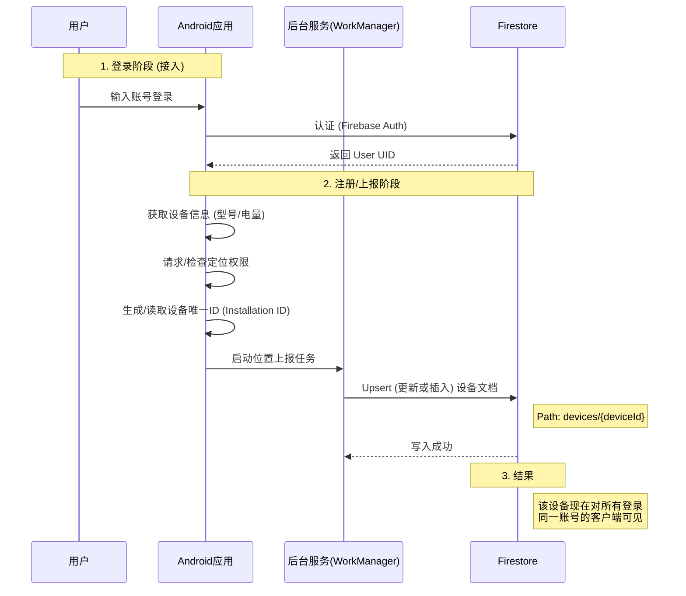

# iOS Find My 设备接入逻辑分析与 Android 实现方案

本文档分析 iOS "查找" (Find My) 中**主机设备**（iPhone, iPad, Mac 等）的接入逻辑，并阐述 Android
端的对应实现方案。

**注意**：本文档讨论的是"运行应用的设备本身"的注册逻辑。关于添加蓝牙物品（如 AirTag），请参考
`ADD_DEVICE_LOGIC.md`。

## 1. iOS 设备接入逻辑分析

在 iOS 生态系统中，"添加设备"是一个**隐式**且**系统级**的过程。用户不需要在 Find My 应用内手动点击"添加
iPhone"。

### 1.1 核心机制：基于账号的自动注册

1. **系统登录**：用户在设备设置 (Settings) 中登录 Apple ID (iCloud)。
2. **功能开启**：用户开启 "查找我的 iPhone" (Find My iPhone) 开关。
3. **自动同步**：系统后台服务 (searchd) 自动将当前设备的硬件信息、位置信息与 Apple ID 关联，并上传至
   Apple 服务器。
4. **列表显示**：该设备立即出现在同账号下其他设备的 "Devices" 列表中。

### 1.2 关键特征

* **无感接入**：无需用户手动输入设备名称或 ID。
* **单一归属**：一台设备同时只能被一个 Apple ID 绑定用于查找。
* **持久化令牌**：设备持有 iCloud 令牌，即使应用未运行也能通过系统级服务上报位置。

---

## 2. Android 端实现方案

在 Android 应用层面，我们模拟这种"登录即注册"的体验。

### 2.1 业务流程设计

Android 应用的"添加设备"过程等同于**"安装应用并登录"**。



### 2.2 关键功能模块

#### A. 设备唯一标识 (Device ID)

为了确保卸载重装后能识别为同一设备，或避免同一账号多台设备冲突，我们需要一个稳定的 ID。

* **方案**：结合 `Settings.Secure.ANDROID_ID` 或在首次运行时生成 UUID 并存储在
  `EncryptedSharedPreferences` 中。
* **当前实现**：目前代码似乎使用随机 UUID 或 Firebase Auth UID（如果是单设备）。
* **建议改进**：
  ```kotlin
  // 伪代码：获取持久化设备ID
  fun getDeviceId(context: Context): String {
      val prefs = context.getSharedPreferences("device_prefs", Context.MODE_PRIVATE)
      var id = prefs.getString("device_id", null)
      if (id == null) {
          id = UUID.randomUUID().toString()
          prefs.edit().putString("device_id", id).apply()
      }
      return "${Build.MODEL}_$id" // 例如: Pixel7_a1b2c3d4
  }
  ```

#### B. 设备元数据自动获取

在首次上报时，自动填充以下信息，无需用户手动输入：

* **名称**：`Build.MODEL` (如 "Pixel 7 Pro") 或 `Settings.Global.DEVICE_NAME` (如果可获取)。
* **类型**：通过 `Configuration.screenLayout` 判断是 PHONE 还是 TABLET。

#### C. 后台保活与自启动

iOS 依赖系统级服务，Android 应用需要利用 `WorkManager` 来实现近似效果。

* **机制**：`PeriodicWorkRequest` (每15分钟)。
* **触发时机**：`MainViewModel` 初始化时（即应用启动登录后）。

### 2.3 权限与隐私

由于"自动注册"涉及隐私位置上传，必须严格遵守 Android 隐私规范：

1. **登录后立即提示**：登录成功进入主页时，请求 `ACCESS_FINE_LOCATION`。
2. **后台定位**：如果需要后台持续追踪，需请求 `ACCESS_BACKGROUND_LOCATION` (Android 10+)。
3. **显式开关**：在设置页提供 "共享我的位置" 开关，允许用户关闭当前设备的上报（对应 iOS 的 "Find My
   iPhone" 开关）。

## 3. 开发指引

### 3.1 当前代码状态

* **入口**：`MainViewModel.init` -> `startPeriodicLocationReport()`。
* **逻辑**：只要用户登录（包括匿名），就开始上报。
* **存储**：`DeviceRepository.saveDevice()` 使用 `set(data)`，这不仅是更新，也是**创建**操作。

### 3.2 优化建议

1. **设备 ID 持久化**：目前如果 ID 是随机生成的，卸载重装会产生"新设备"僵尸数据。建议实现上述 UUID
   持久化逻辑。
2. **旧设备清理**：Firestore 规则或云函数应定期清理超过 30 天未更新的设备（或者提供手动移除功能）。
3. **设备重命名**：允许用户在详情页修改 `customName`，覆盖默认的 `Build.MODEL`。

---
**文档位置**: `@docs\DEVICE_REGISTRATION_LOGIC.md`
