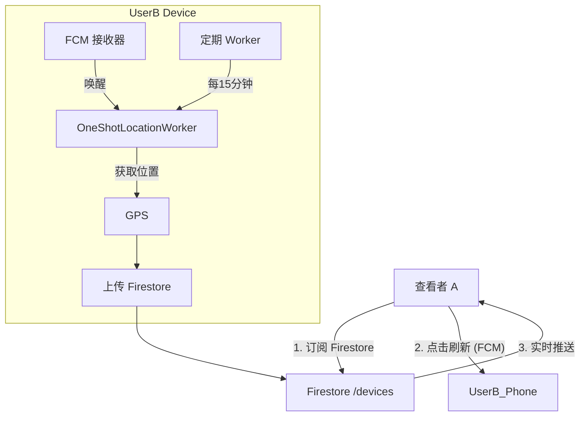

# iOS Find My 位置更新机制分析与 Android 务实实现方案

本文档分析 iOS "查找" (Find My) 的位置更新频率与触发逻辑，并站在 Android 开发者的角度，结合 Android
系统限制（Doze 模式、后台权限），提出一套既能保证实时性又能兼顾电量的务实解决方案。

## 1. iOS Find My 位置更新逻辑分析

iOS 的位置更新并非单一频率，而是基于**状态机**的动态调整策略。

### 1.1 三种更新模式

| 模式                        | 触发场景                 | 更新频率               | 机制                                                                                 |
|:--------------------------|:---------------------|:-------------------|:-----------------------------------------------------------------------------------|
| **被动模式 (Passive)**        | App 在后台/被杀，无人主动查看    | **极低** (15-60分钟)   | 依赖基站切换 (Cell Change) 或显著位置变化 (Significant Location Change)。系统统一唤醒，不耗费额外电量。         |
| **主动查看 (Active Polling)** | 好友打开 App 并点击了你的头像    | **即时 + 短时持续** (On-Demand) | 1. 查看者发送 APNs 静默推送。<br>2. 被查看者设备被唤醒。<br>3. 立即上传一次高精度位置。<br>4. **若查看者未退出，自动进入约 60 秒的“短时实时模式”**，高频更新位置。<br>5. 停止查看或超时后，设备重新休眠。 |
| **实时模式 (Live)**           | 双方建立“实时”会话 (iOS 15+) | **高频** (每 2-5 秒)   | 建立长连接，持续流式传输位置。通常伴随动态岛或状态栏提示。                                                      |

### 1.2 核心“魔法”：APNs 静默唤醒

iOS 的杀手锏在于，即使 App 被完全杀死（非用户手动划掉），APNs 的特殊指令（`content-available: 1`
）也能唤醒设备执行一段代码。这使得 iOS 设备平时可以完全不跑 GPS，只有在**被查询时**才开启 GPS，从而做到极致省电。
/
---

## 2. Android 面临的挑战

在 Android 上复刻上述体验的主要障碍：

1. **后台限制 (Doze Mode)**: 手机静止时网络和 CPU 会被限制。
2. **后台启动限制**: Android 12+ 禁止后台启动前台服务 (Foreground Service)。
3. **FCM 到达率**: 虽然 FCM Data Message 类似于 APNs，但在某些国产 ROM 上，App 进程被杀后 FCM
   可能无法唤醒应用。

---

## 3. Android 务实实现方案

我们采用 **"分级响应策略"**，结合 **WorkManager** (保底)、**FCM** (唤醒) 和 **Firestore** (实时) 来模拟
iOS 体验。

### 3.1 方案架构图



### 3.2 详细分级策略

#### 等级 1：基础保底 (Heartbeat)

* **机制**: `WorkManager` (PeriodicWorkRequest)。
* **频率**: **15 分钟** (Android 系统允许的最小间隔)。
* **用途**: 确保即使没有任何交互，也能看到好友的大致位置（例如：“10分钟前”）。
* **耗电**: 低。

#### 等级 2：按需唤醒 (On-Demand Update) —— **核心推荐**

当用户 A 点击用户 B 的头像时，不仅是读取 Firestore 缓存，而是触发一次主动更新。

* **动作**: A 调用 Cloud Function 或直接发送 FCM Data Message 给 B。
* **Payload**: `{"type": "LOCATION_REQUEST", "requesterUid": "uid_a"}`。
* **B 端处理**:
    1. `MyFirebaseMessagingService` 收到高优先级 Data Message。
    2. 立即启动一个 `Expedited WorkRequest` (加急任务)。
    3. 该任务执行 **"单次高精度定位" (CurrentLocation)**。
    4. 写入 Firestore。
* **效果**: A 会在 5-10 秒内看到 B 的位置从“10分钟前”变为“刚刚”。

#### 等级 3：实时追踪 (Live Track) —— **可选高配**

如果需要像微信“共享实时位置”那样连续更新。

* **机制**: 前台服务 (Foreground Service)。
* **触发**: 必须由 **B 主动开启**，或者 B 在收到 A 的请求后，弹窗通知 B “A 正在请求实时位置”，B
  点击允许后开启。
* **注意**: 必须在通知栏显示“正在共享位置”，否则会被系统杀掉且不符合隐私规范。

---

## 4. 具体开发落地方案

### 4.1 数据结构调整 (Firestore)

无需大改，只需在 `devices` 集合中利用现有的 `location` 和 `lastUpdateTime`。
但为了支持 FCM 唤醒，`users` 集合必须存储 **FCM Token**。

```json
// users/{uid}
{
  "fcmTokens": ["token_pixel_7", "token_samsung_s23"]
}
```

### 4.2 客户端逻辑实现 (Kotlin)

#### A. 发送位置请求 (User A)

在 `ContactViewModel` 中实现：

```kotlin
fun requestUpdate(targetUid: String) {
    // 调用 Cloud Function 发送 FCM
    functions.getHttpsCallable("requestLocationUpdate").call(mapOf("targetUid" to targetUid))
    // 或者 (简化版) 如果客户端有权限，直接写一个标志位到 Firestore，触发 B 的监听（如果 B 在线）
}
```

#### B. 接收并上报 (User B)

**1. FCM Service (`MyFirebaseMessagingService.kt`)**

```kotlin
override fun onMessageReceived(message: RemoteMessage) {
    if (message.data["type"] == "LOCATION_REQUEST") {
        // 启动加急任务
        val request = OneTimeWorkRequestBuilder<LocationReportWorker>()
            .setExpedited(OutOfQuotaPolicy.RUN_AS_NON_EXPEDITED_WORK_REQUEST)
            .setInputData(workDataOf("isOneShot" to true))
            .build()
        WorkManager.getInstance(context).enqueue(request)
    }
}
```

**2. 改造 Worker (`LocationReportWorker.kt`)**
目前 Worker 可能是为了定期任务设计的，需要支持“单次极速模式”。

```kotlin
override suspend fun doWork(): Result {
    val isOneShot = inputData.getBoolean("isOneShot", false)
    
    // 如果是 OneShot，使用高精度，短超时
    val priority = if (isOneShot) Priority.PRIORITY_HIGH_ACCURACY else Priority.PRIORITY_BALANCED_POWER_ACCURACY
    
    val location = locationClient.getCurrentLocation(priority, token).await()
    
    // 上传 Firestore...
    return Result.success()
}
```

### 4.3 隐私与体验优化

1. **防抖动**: 为了防止 A 疯狂点击刷新导致 B 耗电，B 端应设置冷却时间（例如：1分钟内只响应一次
   `LOCATION_REQUEST`）。
2. **状态反馈**: 当 B 正在更新时，A 的 UI 应该显示 "正在定位..." (Locating...)，直到 Firestore 监听到新的
   `lastUpdateTime`。

---

## 5. 总结：建议实施路径

1. **阶段一 (现状)**: 保持 15 分钟定期上报。满足基本的“他在哪”需求。
2. **阶段二 (即时)**: 引入 FCM Data Message。实现“点开即更新”。这是性价比最高的优化，能覆盖 80%
   的“找不到人”焦虑场景。
3. **阶段三 (实时)**: 仅在特定业务场景（如导航接人）下，通过显式按钮开启前台服务进行 1秒/次 的更新。

建议优先完成 **阶段二**，它能显著提升“查找”的可用性，缩小与 iOS 体验的差距。
