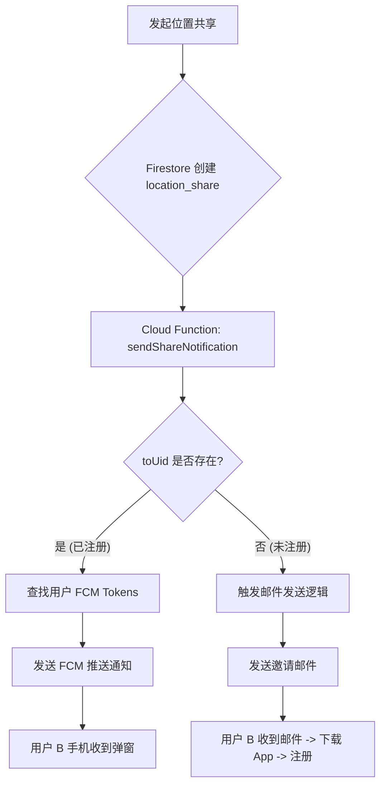

# 推送通知与未注册用户处理指南 (PUSH_NOTIFICATION_GUIDE.md)

本文档详细介绍了如何使用 Firebase Cloud Messaging (FCM) 和 Cloud Functions 实现位置共享邀请的通知功能，并专门解决了
**未注册用户接收通知**的问题。

## 1. 核心逻辑流程

当用户 A (`fromUid`) 向用户 B (`toEmail`) 发起位置共享时，系统执行以下逻辑：



## 2. 详细解决方案

### 场景一：目标用户已注册 (使用 FCM)

如果 `location_shares` 文档中 `toUid` 字段不为空，说明用户已经注册。

* **机制**: Cloud Function 查询 `users/{toUid}` 文档，获取 `fcmTokens` 数组。
* **动作**: 向这些 Token 发送 FCM 消息。
* **客户端**: Android 端 `MyFirebaseMessagingService` 接收消息并弹出通知。

### 场景二：目标用户未注册 (使用邮件)

如果 `toUid` 为空，说明该邮箱尚未在平台注册。**FCM 无法推送到未知设备**。

* **机制**: 必须依赖 **Email** 作为通知渠道。
* **推荐方案**: 使用 Firebase Extensions —— **Trigger Email** (由 SendGrid 或 SMTP 支持)。
* **实现步骤**:
    1. 在 Firebase Console 安装 "Trigger Email" 扩展。
    2. 配置扩展监听一个特定的集合（例如 `mail`）。
    3. Cloud Function 检测到未注册用户时，向 `mail` 集合写入一条数据：
       ```json
       {
         "to": "target@email.com",
         "message": {
           "subject": "Find My - 位置共享邀请",
           "text": "用户 A 想要与您共享位置。请下载 App 并使用此邮箱注册以查看。",
           "html": "<strong>用户 A</strong> 想要与您共享位置。<br>请 <a href='https://your-app-link'>下载 App</a> 并注册。"
         }
       }
       ```
    4. 扩展会自动发送邮件。

---

## 3. Cloud Functions 代码示例

请在你的 Firebase 项目的 `functions/index.js` (或 `index.ts`) 中部署以下代码。

**注意**: 需要先运行 `npm install firebase-functions firebase-admin`。

```javascript
const functions = require("firebase-functions");
const admin = require("firebase-admin");
admin.initializeApp();

/**
 * 监听 location_shares 集合的新增文档
 */
exports.sendShareNotification = functions.firestore
    .document("location_shares/{shareId}")
    .onCreate(async (snap, context) => {
        const shareData = snap.data();
        const fromUid = shareData.fromUid;
        const toEmail = shareData.toEmail;
        const toUid = shareData.toUid;

        // 1. 获取发送者信息 (用于显示名字)
        const senderSnap = await admin.firestore().collection("users").doc(fromUid).get();
        const senderName = senderSnap.data().displayName || senderSnap.data().email || "有人";

        // ==========================================================
        // 分支 A: 用户已注册 -> 发送 FCM 推送
        // ==========================================================
        if (toUid) {
            console.log(`向已注册用户 ${toUid} 发送推送`);
            
            const userSnap = await admin.firestore().collection("users").doc(toUid).get();
            const userData = userSnap.data();

            if (userData && userData.fcmTokens && userData.fcmTokens.length > 0) {
                const payload = {
                    notification: {
                        title: "新位置共享邀请",
                        body: `${senderName} 想要与您共享位置`,
                        click_action: "OPEN_MAIN_ACTIVITY" // Android Intent Filter Action
                    },
                    data: {
                        type: "SHARE_INVITE",
                        shareId: context.params.shareId
                    }
                };

                // 发送给用户的所有设备
                const response = await admin.messaging().sendToDevice(userData.fcmTokens, payload);
                console.log("FCM 发送结果:", response);

                // 清理失效的 Token (可选优化)
                // ...
            } else {
                console.log("用户没有 FCM Token，可能未安装 App 或未登录");
            }
        } 
        // ==========================================================
        // 分支 B: 用户未注册 -> 发送邮件
        // ==========================================================
        else {
            console.log(`用户 ${toEmail} 未注册，准备发送邮件`);

            // 方法 1: 写入 Firestore 'mail' 集合 (需安装 Trigger Email 扩展)
            await admin.firestore().collection("mail").add({
                to: toEmail,
                message: {
                    subject: "【Find My】位置共享邀请",
                    html: `
                        <h2>您收到一个新的位置共享邀请</h2>
                        <p><strong>${senderName}</strong> 想要与您共享实时位置。</p>
                        <p>请点击下方链接下载 App，并使用邮箱 <strong>${toEmail}</strong> 注册账号：</p>
                        <p><a href="https://play.google.com/store/apps/details?id=me.ikate.findmy">下载 Find My App</a></p>
                    `
                }
            });
            
            console.log("邮件发送请求已写入 mail 集合");
        }
    });
```

## 4. 客户端后续处理

当未注册用户收到邮件并完成注册后：

1. 用户使用 `toEmail` 登录。
2. App 启动时调用 `ContactRepository.observeMyContacts()`。
3. 该函数会查询 `location_shares` 中 `toEmail == currentEmail` 的记录。
4. 用户将立即在“联系人”列表中看到待处理的邀请。
5. **无需额外的逻辑**，现有的邮箱匹配机制会自动关联。
